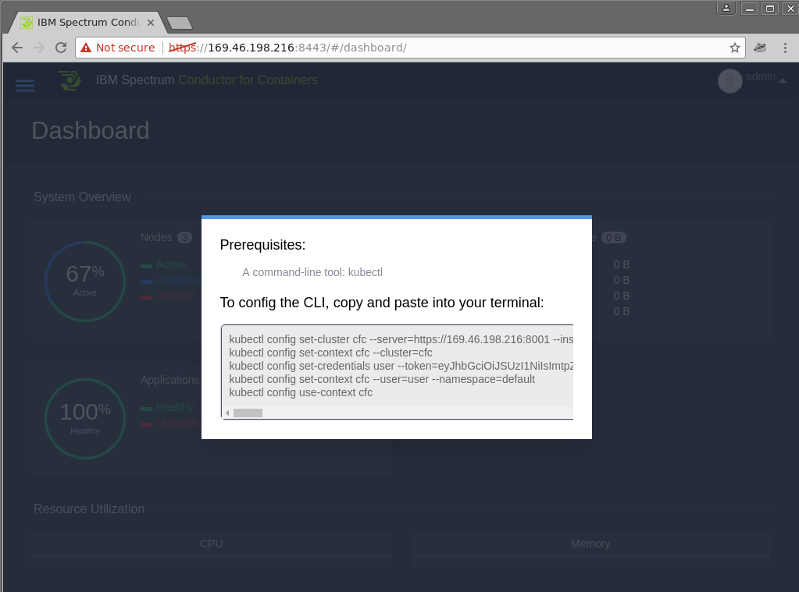

Lagom is an opinionated microservices framework available to Java and Scala developers that
has been designed to help build, deploy, and run systems with confidence. Lagom
is part of the [Reactive Framework](https://www.lightbend.com/products/reactive-platform)
developed by IBM partner [Lightbend](https://www.lightbend.com) to bring a
modern message driven runtime to Java and Scala.

One would assume that being a microservices framework that it would be a perfect
fit for running in Containers on a modern Kubernetes Infrastructure. That
assumption when tested proves to be correct as you will see in this tutorial.

The goal of this tutorial is to demonstrate that you can take an application
developed within the Lagom framework and deploy it to a modern Container based
Kubernetes Infrastructure.

## Getting Started

To run a Lagom application on Kubernetes we need two things, which should be
pretty obvious, a Lagom app and a Kubernetes. For the app we'll use an example from
the lightbend team called [chirper](https://github.com/IBM/activator-lagom-java-chirper),
For Kubernetes we can use [minikube](https://github.com/kubernetes/minikube) or IBM's
[Bluemix Container Service](https://www.ibm.com/cloud-computing/bluemix/containers)
depending on whether you want to run it locally or not.

Chirper is a twitter like application written in the Lagom framework and utilizes
advanced features like akka clustering, and service discovery. To utilize these correctly
requires the use of a number of Kubernetes resources.  Thankfully the folks that maintain 
this project provide kubernetes manifests to take advantage of these features such as `StatefulSet`,
`Service`, `Ingress`. You can dig into the deployment manifests at `deploy/kubernetes/resources`
after we clone the Chirper git repo in the next steps.

### Chirper

Install the following on your system:

* [Docker](https://store.docker.com/search?type=edition&offering=community)
* [OpenJDK 8](http://openjdk.java.net/install/)
* [Maven](https://maven.apache.org/download.cgi#)

Once you have those installed you can clone the Chirper source code locally from our Fork (and branch).

 ```bash
$ git clone https://github.com/IBM/activator-lagom-java-chirper chirper
$ cd chirper
$ git checkout deploy-to-bluemix
 ```

### Kubernetes

Due to the build and deploy of Chirper being quite resource intensive it is recommended to use a 
hosted kubernetes offering like Bluemix Container Service (BCS). However this is not always practical
for people so this tutorial will provide instructions on how to deploy Chirper to Minikube which 
can be run locally on your machine as well as instructions to deploy to BCS.

1. [Deploy to Minikube](#instructions-for-deploying-to-minikube)
2. [Deploy to Bluemix Container Service Lite](#instructions-for-deploying-to-bluemix-container-service-lite)

## Instructions for deploying to Minikube

### Install Minikube

Install `minikube` and `kubeadmn` on your system using the instructions found
in the [minikube](https://kubernetes.io/docs/tasks/tools/install-minikube/) install
documentation.

> Note: if you already have minikube installed you may want to ensure its clean by
running `$ minikube delete` before running `$ minikube start` below.

Once installed you can start a local kubernetes instance by running:

```bash
$ minikube start --memory 4096
$ kubectl get nodes
NAME       STATUS    AGE       VERSION
minikube   Ready     5m       v1.6.4
```


### Build Chirper with Maven

Minikube has a way to expose its Docker endpoint to your local Docker client, this will allow us to build the required images for Chirper directly on the kubernetes cluster and remove the need to upload them to a registry.

```
$ eval $(minikube docker-env)
$ docker ps
CONTAINER ID        IMAGE                                      COMMAND                  CREATED             STATUS              PORTS               NAMES
3effb29a997f        7c4034e4ffa4                               "/sidecar --v=2 --..."   20 seconds ago      Up 20 seconds                           k8s_sidecar_kube-dns-1301475494-ljqx6_kube-system_493f2edc-8cf8-11e7-aa20-080027c65e30_0
ef198b4b928c        e5c335701995                               "/dnsmasq-nanny -v..."   23 seconds ago      Up 22 seconds                           k8s_dnsmasq_kube-dns-1301475494-ljqx6_kube-system_493f2edc-8cf8-11e7-aa20-080027c65e30_0
...
...
```

Now we have a working Kubernetes we can start the build process for 
chirper. `maven` supports building Docker images so building the application should be as
simple as running:

```
$ mvn clean package docker:build
[INFO] Scanning for projects...
[INFO] ------------------------------------------------------------------------
[INFO] Reactor Build Order:
[INFO]
...
...
[INFO] BUILD SUCCESS
[INFO] ------------------------------------------------------------------------
[INFO] Total time: 02:59 min
[INFO] Finished at: 2017-08-29T15:59:13-05:00
[INFO] Final Memory: 96M/803M
[INFO] ------------------------------------------------------------------------
```

### Deploy Chirper to Minikube

The Chirper repo contains kubernetes manifests already which makes this a fairly
simple process.

First we need to deploy a Cassandra database backend for our data:

> Note: You will need to hit Ctrl-C to break from the `kubectl get pods -w`
command to continue with the steps.

```bash
$ kubectl create -f deploy/kubernetes/resources/cassandra
$ kubectl get pods -w
...
...
cassandra-0   1/1       Running   0          1m
^C                 
$ kubectl exec cassandra-0 -- nodetool status
Datacenter: DC1-K8Demo
======================
Status=Up/Down
|/ State=Normal/Leaving/Joining/Moving
--  Address     Load       Tokens       Owns (effective)  Host ID                               Rack
UN  172.17.0.4  99.45 KiB  32           100.0%            ce75418d-e9b1-49ad-80a1-ed93ff893356  Rack1-K8Demo
```


Once Cassandra is running we can deploy our the chirper microservices:

```
$ kubectl create -f deploy/kubernetes/resources/chirper
$ kubectl get pods -w
NAME                READY     STATUS    RESTARTS   AGE
activityservice-0   0/1       Running   0          11s
cassandra-0   1/1       Running   0         7m
chirpservice-0   0/1       Running   0         10s
friendservice-0   0/1       Running   0         10s
web-0     0/1       Running   0         10s
web-0     1/1       Running   0         26s
^C
```


Finally we can deploy our Ingress resources and NGINX and make our app accessible:

```
$ kubectl create -f deploy/kubernetes/resources/nginx

kubectl get pods -w                                
NAME                READY     STATUS    RESTARTS   AGE
nginx-default-backend-1298687872-m2fwr   0/1       ContainerCreating   0         2s
nginx-ingress-controller-1705403548-lwwwt   0/1       ContainerCreating   0         2s
nginx-ingress-controller-1705403548-lwwwt   0/1       Running   0         11s
nginx-default-backend-1298687872-m2fwr   1/1       Running   0         14s
^C
```

Once deployed you should be able to access Chirper via its web UI, minikube can provide those details for
you like so:

```
$ minikube service --url nginx-ingress | head -n 1
http://192.168.99.100:32327
```

Copy and paste the URL provided by the above command into your browser and [Use the Chirper App](#use-the-chirper-app)


## Instructions for deploying to Bluemix Container Service Lite

### Create Bluemix Container Service (Lite) Cluster

Follow the instructions [here](https://github.com/IBM/container-journey-template/blob/master/README.md)
to create a free single node Kubernetes cluster on Bluemix Container Service.

Check that nothing else is running on your cluster:

```bash
$ kubectl get pods
No resources found.
```

### Deploy Chirper to Kubernetes

The Chirper repo contains kubernetes manifests already which makes this a fairly
simple process.

First we need to deploy a Cassandra database backend for our data:

> Note: You will need to hit Ctrl-C to break from the `kubectl get pods -w`
command to continue with the steps.

```bash
$ kubectl create -f deploy/kubernetes/resources/cassandra
$ kubectl get pods -w
...
...
cassandra-0   1/1       Running   0          1m
^C                 
$ kubectl exec cassandra-0 -- nodetool status
Datacenter: DC1-K8Demo
======================
Status=Up/Down
|/ State=Normal/Leaving/Joining/Moving
--  Address     Load       Tokens       Owns (effective)  Host ID                               Rack
UN  172.17.0.4  99.45 KiB  32           100.0%            ce75418d-e9b1-49ad-80a1-ed93ff893356  Rack1-K8Demo
```

Next you need to update the chirper manifests to use the images from the registry rather than
the local Docker service.

Unfortunately this is a bit painful as you need to find all files in
`deploy/kubernetes/resources/chirper/*-statefulset.json` that have 
images specified and update them accordingly.  You'll also need to
delete the line following it `"imagePullPolicy": "Never",` to ensure
kubernetes will pull the image.

For example in `deploy/kubernetes/resources/chirper/chirp-impl-statefulset.json`
you need to change the following:

```json
            "image": "chirper/friend-impl",
            "imagePullPolicy": "Never",
```

to be 

```json
            "image": "ibmcode/chirper_chirp-impl",
```

Once you have modified the manifests you can deploy the application with `kubectl`:

```
$ kubectl create -f deploy/kubernetes/resources/chirper
$ kubectl get pods -w
NAME                READY     STATUS    RESTARTS   AGE
activityservice-0   0/1       Running   0          11s
cassandra-0   1/1       Running   0         7m
chirpservice-0   0/1       Running   0         10s
friendservice-0   0/1       Running   0         10s
web-0     0/1       Running   0         10s
web-0     1/1       Running   0         26s
^C
```

Finally we can deploy our Ingress resources and NGINX and make our app accessible:

```
$ kubectl create -f deploy/kubernetes/resources/nginx

kubectl get pods -w                                
NAME                READY     STATUS    RESTARTS   AGE
nginx-default-backend-1298687872-m2fwr   0/1       ContainerCreating   0         2s
nginx-ingress-controller-1705403548-lwwwt   0/1       ContainerCreating   0         2s
nginx-ingress-controller-1705403548-lwwwt   0/1       Running   0         11s
nginx-default-backend-1298687872-m2fwr   1/1       Running   0         14s
^C
```

Once deployed you should be able to access Chirper via its web UI, to do this we need to request some information from Bluemix and from Kubernetes and combine the results:

```
$ kubectl get services nginx-ingress
NAME            CLUSTER-IP     EXTERNAL-IP   PORT(S)                      AGE
nginx-ingress   10.10.10.103   <pending>     80:30190/TCP,443:32514/TCP   10m

$ bx cs workers [name-of-cluster]           
ID                    Public IP        Private IP     Machine Type   State    Status   
kube-hou02-xxxxx-w1   169.48.162.22   10.10.10.22   free           normal   Ready   
```

To get the URL of our application we can combine the Public IP from the `bx cs workers` command with the private port of the `nginx-ingress` service. 
The URL for the above results would be http://169.48.162.22:30190 which can be punched into your web browser and [Use the Chirper App](#use-the-chirper-app).

## Instructions for a Production deploy to IBM Cloud

### Create Bluemix Container Service Cluster

Use the [Bluemix UI](https://console.bluemix.net) to create a [Bluemix Container Service](https://console.bluemix.net/docs/containers/container_index.html#container_index) called `chirper`

> Note: You could use the CLI, but you have to do a bunch of detective work to determine what values to use for machine type, location, vlan, etc. For the sake of the demo it is much easier to use the webui.

Once the cluster is created we can switch to the bluemix cli and ensure that its ready:

```bash
$ bx cs cluster-config chirper
OK
The configuration for chirper was downloaded successfully. Export environment variables to start using Kubernetes.

export KUBECONFIG=/home/xxx/.bluemix/plugins/container-service/clusters/chirper/kube-config-dal10-chirper.yml

$ export KUBECONFIG=/home/xxx/.bluemix/plugins/container-service/clusters/chirper/kube-config-dal10-chirper.yml
$ kubectl get nodes
NAME             STATUS    AGE       VERSION
169.48.134.165   Ready     110d      v1.5.6-4+abe34653415733
169.48.134.169   Ready     110d      v1.5.6-4+abe34653415733
169.48.134.172   Ready     110d      v1.5.6-4+abe34653415733
```

### Create a Bluemix Container Registry

In production we want to ensure that we own the availabilty and versions of the Images we will run.  To do so we can use the
Bluemix Container Service.


```bash
$ bx plugin install container-registry -r Bluemix
$ bx cr namespace-add chirper
Adding namespace 'chirper'...
Successfully added namespace 'chirper'

$ bx cr login                                      
Logging in to 'registry.ng.bluemix.net'...
Logged in to 'registry.ng.bluemix.net'.
OK
```

### Deploy Chirper to Production

#### Deploy a Cassandra Database

Before we can run our microservices we need a Cassandra database.  Since this is a production deploy we will create
a multiple node Cassandra cluster with Persistant volumes.

Fetch the Cassandra Docker Image and push it into our own Registry:

```
$ docker pull gcr.io/google-samples/cassandra:v12 && \
  docker tag  gcr.io/google-samples/cassandra:v12 registry.ng.bluemix.net/chirper/cassandra:v12 && \
  docker push registry.ng.bluemix.net/chirper/cassandra:v12
```

Create a Cassandra Service and a 3 node Cassandra Statefulset with Persistent Volumes:

Note: You will need to hit Ctrl-C to break from the kubectl get pods -w command to continue with the steps.

```
$ kubectl create -f deploy/bluemix-container-service/cassandra && \
  kubectl get pods -w         
service "cassandra" created
statefulset "cassandra" created
                               
NAME          READY     STATUS              RESTARTS   AGE
cassandra-0   0/1       ContainerCreating   0          2s
cassandra-0   0/1       Running   0         3s
^C
```


#### Build the Chirper Docker Images

The next step is to build the Chirper containers, to do this we're going to be
a bit cheeky and use the official Maven Docker image to build it for us by mapping in both our docker socket and the chirper source:

```bash
$ docker run -v /var/run/docker.sock:/var/run/docker.sock \
   -v $(pwd):/src -w /src maven mvn clean package docker:build
...
...
[INFO] BUILD SUCCESS
[INFO] ------------------------------------------------------------------------
[INFO] Total time: 03:32 min
[INFO] Finished at: 2017-09-12T15:23:50Z
[INFO] Final Memory: 92M/801M
[INFO] ------------------------------------------------------------------------ 

$ docker images | grep chirper | grep "1\.0"
chirper/front-end                                     1.0-SNAPSHOT        bcdd958e3ab5        55 seconds ago       132MB
chirper/load-test-impl                                1.0-SNAPSHOT        9e46ef8b7443        About a minute ago   143MB
chirper/activity-stream-impl                          1.0-SNAPSHOT        b2610649d20f        About a minute ago   143MB
chirper/chirp-impl                                    1.0-SNAPSHOT        d90d06316151        2 minutes ago        143MB
chirper/friend-impl                                   1.0-SNAPSHOT        f6a9a1b0a900        2 minutes ago        143MB
```

> If for whatever reason you can't map in these paths you can run the maven build command if you have java and maven installed.  `mvn clean package docker:build`.

Next push the images to the Bluemix Registry:

```
for i in $(docker images | grep '^chirper' | grep "1\.0" | awk '{ print $1 ":" $2}'); do
    docker tag $i registry.ng.bluemix.net/$i
    docker push registry.ng.bluemix.net/$i
done
```

> Note: the above bash for loop should work on any Linux or Mac machine.  If it doesn't you may need to modify it, or just run the `docker tag` and `docker push` commands for each container manually.

#### Deploy the Chirper microservices to kubernetes

Next you need to update the chirper manifests to use the images from the registry rather than
the local Docker service.

Assuming you created the registry and pushed up the images as instructed our Kubernetes manifests should be know where to find them:

```
$ kubectl create -f deploy/bluemix-container-service/chirper && \
  kubectl get pods -w
NAME                READY     STATUS    RESTARTS   AGE
activityservice-0   0/1       Running   0          11s
cassandra-0   1/1       Running   0         7m
chirpservice-0   0/1       Running   0         10s
friendservice-0   0/1       Running   0         10s
web-0     0/1       Running   0         10s
web-0     1/1       Running   0         26s
^C
```

#### Deploy nginx Ingress resources

Fetch the NGINX Docker Image and push it into our own Registry:

```
$ docker pull gcr.io/google_containers/defaultbackend:1.0 && \
  docker tag  gcr.io/google_containers/defaultbackend:1.0 registry.ng.bluemix.net/chirper/defaultbackend:1.0 && \
  docker push registry.ng.bluemix.net/chirper/defaultbackend:1.0

$ docker pull gcr.io/google_containers/nginx-ingress-controller:0.9.0-beta.10 && \
  docker tag  gcr.io/google_containers/nginx-ingress-controller:0.9.0-beta.10 registry.ng.bluemix.net/chirper/nginx-ingress-controller:0.9.0-beta.10 && \
  docker push registry.ng.bluemix.net/chirper/nginx-ingress-controller:0.9.0-beta.10
```

In order to use the Bluemix provided subdomain for your cluster we need to update the ingress service with it.

get the Ingress subdomain from the Bluemix CLI

```
$ bx cs cluster-get chirper | grep subdomain
Ingress subdomain:	chirper.us-south.containers.mybluemix.net
```

uncomment and update `#    host: your-dns-goes-here` to match the subdomain `    host: chirper.us-south.containers.mybluemix.net`

Deploy the Ingress resources and NGINX and make our app accessible:

```
$ kubectl create -f deploy/kubernetes/resources/nginx && \
  kubectl get pods -w
NAME                READY     STATUS    RESTARTS   AGE
nginx-default-backend-1298687872-m2fwr   0/1       ContainerCreating   0         2s
nginx-ingress-controller-1705403548-lwwwt   0/1       ContainerCreating   0         2s
nginx-ingress-controller-1705403548-lwwwt   0/1       Running   0         11s
nginx-default-backend-1298687872-m2fwr   1/1       Running   0         14s
^C
```

Once deployed you should be able to access Chirper via its web UI, to do this we need to request some information from Bluemix and from Kubernetes and combine the results:

```
$ kubectl get services nginx-ingress
NAME            CLUSTER-IP     EXTERNAL-IP   PORT(S)                      AGE
nginx-ingress   10.10.10.103   169.48.162.197     80:30190/TCP,443:32514/TCP   10m
```

To get the URL of our application we can combine the Public IP from the `bx cs workers` command with the private port of the `nginx-ingress` service. 
The URL for the above results would be http://169.48.162.197 which can be punched into your web browser and [Use the Chirper App](#use-the-chirper-app).

#### Scale our microservices

Our microservices are running as statefulsets, but our manifests (apart from cassandra) had them with just a single replica.  For high availability we should have multiple
of each running.

To see how many replicas we're running:

```
$ kubectl get statefulset           
NAME              DESIRED   CURRENT   AGE
activityservice   1         1         58m
cassandra         3         3         1h
chirpservice      1         1         58m
friendservice     1         1         58m
web               1         1         58m
```

We can update them using the `kubectl scale` command:

```
$ kubectl scale --replicas=2 statefulset/web statefulset/chirpservice statefulset/friendservice statefulset/activityservice
statefulset "web" scaled
statefulset "chirpservice" scaled
statefulset "friendservice" scaled
statefulset "activityservice" scaled
$ kubectl get statefulset
NAME              DESIRED   CURRENT   AGE
activityservice   2         2         1h
cassandra         3         3         1h
chirpservice      2         2         1h
friendservice     2         2         1h
web               2         2         1h
```

### Instructions for deploying to IBM Cloud Private (ICP)

> Note: If you don't have access to an IBM Cloud Private cluster you can install one by following the instructions [here](https://github.com/IBM/deploy-ibm-cloud-private).

Configure `kubectl` using the instructions provided by your ICP cluster (click Admin in top right hand corner and select "configure client")



```bash
$ kubectl config set-cluster cfc --server=https://169.46.198.xxx:8001 --insecure-skip-tls-verify=true
$ kubectl config set-context cfc --cluster=cfc
$ kubectl config set-credentials user --token=eyJhbGciOiJSUzI1NXXXSSSS
$ kubectl config set-context cfc --user=user --namespace=default
$ kubectl config use-context cfc
```

#### Create ICP Docker Registry Namespace

Create a new Docker Registry Namespace "chirper" by clicking the menu on the top left corner and choosing System -> Organization -> Namespaces -> New Namespace.


> Note: I am as yet unable to access the docker registry on the ICP system.  I get the error message on docker login: `Error response from daemon: Get https://169.46.198.212:8500/v1/users/: x509: cannot validate certificate for 169.46.198.212 because it doesn't contain any IP SANs` or `Get https://master.cfc:8500/v1/users/: x509: certificate signed by unknown authority` depending if I use IP or DNS.  Therefore we'll just use the images in the public docker registry under ibmcode.

#### Deploy Cassandra to ICP

> Note: We can create Volumes but we get errors if we try to claim those volumes for Cassandra, so the claims are currently commented out.

First we need to deploy a Cassandra database backend for our data:

> Note: You will need to hit Ctrl-C to break from the `kubectl get pods -w`
command to continue with the steps.

```bash
$ kubectl create -f deploy/ibm-cloud-private/cassandra
$ kubectl get pods -w
...
...
cassandra-0   1/1       Running   0          1m
^C                 
$ kubectl exec cassandra-0 -- nodetool status
Datacenter: DC1-K8Demo
======================
Status=Up/Down
|/ State=Normal/Leaving/Joining/Moving
--  Address     Load       Tokens       Owns (effective)  Host ID                               Rack
UN  172.17.0.4  99.45 KiB  32           100.0%            ce75418d-e9b1-49ad-80a1-ed93ff893356  Rack1-K8Demo
```

#### Deploy Chirper to ICP

Once cassandra is running you can deploy the application with `kubectl`:

```
$ kubectl create -f deploy/kubernetes/resources/chirper
$ kubectl get pods -w
NAME                READY     STATUS    RESTARTS   AGE
activityservice-0   0/1       Running   0          11s
cassandra-0   1/1       Running   0         7m
chirpservice-0   0/1       Running   0         10s
friendservice-0   0/1       Running   0         10s
web-0     0/1       Running   0         10s
web-0     1/1       Running   0         26s
^C
```

#### Deploy NGINX to ICP

We can deploy our Ingress resources and NGINX and make our app accessible:

```
$ kubectl create -f deploy/kubernetes/resources/nginx

kubectl get pods -w                                
NAME                READY     STATUS    RESTARTS   AGE
nginx-default-backend-1298687872-m2fwr   0/1       ContainerCreating   0         2s
nginx-ingress-controller-1705403548-lwwwt   0/1       ContainerCreating   0         2s
nginx-ingress-controller-1705403548-lwwwt   0/1       Running   0         11s
nginx-default-backend-1298687872-m2fwr   1/1       Running   0         14s
^C
```

Once deployed you should be able to access Chirper via its web UI, to do this we need to request some information Kubernetes and combine the results:

```
$ kubectl get services nginx-ingress
NAME            CLUSTER-IP     EXTERNAL-IP   PORT(S)                      AGE
nginx-ingress   10.10.10.103   <pending>     80:30190/TCP,443:32514/TCP   10m

kubectl get nodes
NAME             STATUS                     AGE       VERSION
169.46.198.194   Ready                      1d        v1.5.2
169.46.198.212   Ready,SchedulingDisabled   1d        v1.5.2
169.46.198.214   Ready                      1d        v1.5.2
```

To get the URL of our application we can combine the "Name" of a worker node (in this case .194 or .214) from the `kubectl get nodes` command with the private port of the `nginx-ingress` service. 
The URL for the above results would be http://169.46.198.194:30190 which can be punched into your web browser and [Use the Chirper App](#use-the-chirper-app).

> Note: You may need to try multiple worker nodes as NodePort in ICP only appears to be shared on the node that the Pod is running on?

## Use the Chirper App

Open your browser to either the HTTP or HTTPS URL provided from the above commands:


Log in and make some "chirps":


## Clean up demo

Once you're finished you may want to clean your cluster and delete the cluster if you're finished with it.

Delete the services we deployed:

```
$ kubectl delete -f deploy/kubernetes/resources/nginx
$ kubectl delete -f deploy/kubernetes/resources/chirper
$ kubectl delete -f deploy/kubernetes/resources/cassandra
```

Delete your Bluemix Cluster:

```
$ bx cs cluster-rm <name-of-cluster>
Remove the cluster? [name-of-cluster] (Y/N)> Y
Removing cluster name-of-cluster...
OK
```